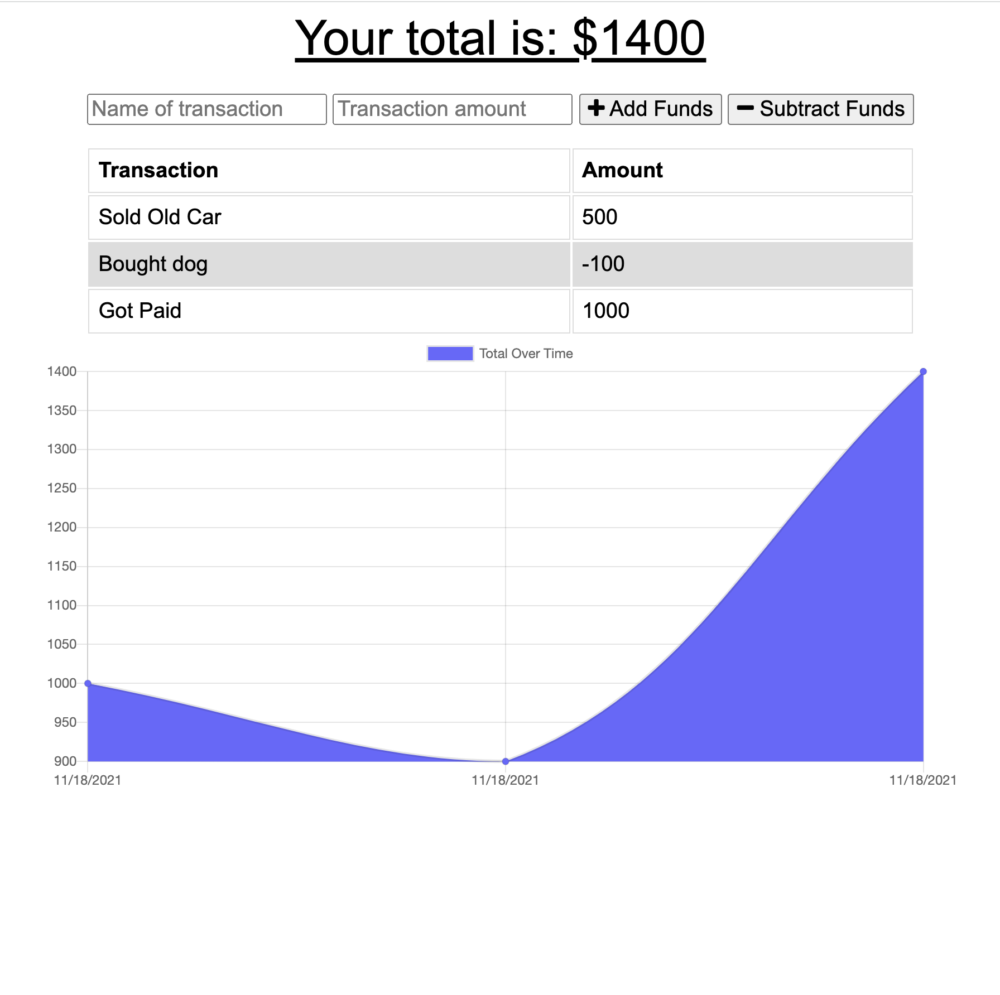

# Budget Tracker

## Description

This application allows users to easily track their withdrawals and deposits with or without a data/internet connection so that the account balance is accurate when even when traveling without internet. Users can add and subtract funds and see the inpact of their withdrawals and desposits in a chart dictating the total over time.

## Table of Contents

- [Usage](#usage)
- [License](#license)
- [How to Contribute](#contribute)
- [Questions](#questions)

 
 
  
  ## Usage
After entering into the website, you can do the following.

1. See the Chart that shows withdrawals and desposits.

2. See the total amount of money

3. Add a new Transaction that will either add or subtract from the total amout

## Website Pictures
 

### Below you will see this application

 

# Website URL

https://floating-ocean-33123.herokuapp.com/?id=618f30f0e5d02e292e20f9d4

## License

The license used for this project: MIT

## Contribute

If you would like to contribute please contact me.

## Questions

To reach me please contact me in the email address below!

- GitHub: https://github.com/KarenHarley
- Email: karenharley88@gmail.com
